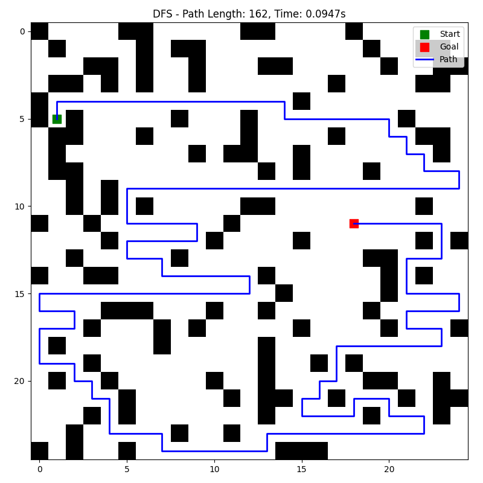

# EC558 Assignment 1: Solving a Maze Using Search Algorithms

## Introduction

This project implements and compares various search algorithms to navigate a 2D maze. The implemented algorithms include uninformed search methods (Breadth-First Search and Depth-First Search) and informed search (A\* Search), along with additional algorithms for comparison.

## Problem Statement

- 25×25 two-dimensional maze
- Positions can be empty or blocked
- Random starting and exit positions
- Agent can move only up, down, left, or right (no diagonal moves)
- Goal: Find the optimal path from start to exit
- Path cost: Number of positions traversed (including start and exit)

## Setup and Usage

### Requirements

- Python 3.x
- NumPy
- Matplotlib
- Pandas (for metrics collection)

### Installation

```bash
# Clone the repository (if applicable)
git clone https://github.com/yourusername/maze-search-algorithms.git
cd maze-search-algorithms

# Install dependencies
pip install numpy matplotlib pandas
```

### Running the Code

The project includes several scripts:

1. **Main entry point:**

```bash
python Assignment1/run.py
```

2. **Command-line arguments:**

```bash
# Run all algorithms once and visualize results
python Assignment1/run.py --mode main

# Collect performance metrics over multiple runs
python Assignment1/run.py --mode collect

# Run both main visualization and collect metrics
python Assignment1/run.py --mode all
```

3. **Individual components:**

```bash
# Run the main algorithm comparison
python Assignment1/main.py

# Run the data collection script
python Assignment1/collect_data.py
```

## Implemented Search Algorithms

### 1. Breadth-First Search (BFS)

BFS explores all neighbors at the current depth before moving to nodes at the next depth level. This guarantees finding the shortest path in an unweighted graph.

#### Implementation Details

The BFS implementation uses a queue data structure to explore nodes in FIFO order. When a node is dequeued, its neighbors are added to the queue if they haven't been visited yet. This process continues until the goal is found or the entire reachable maze has been explored.

#### Sample Output

```
Expanded 378 nodes
Path length: 31
Execution time: 31.2ms
```


_Figure 1: BFS exploration pattern showing shortest path (in blue) from start (green) to goal (red)_

### 2. Depth-First Search (DFS)

DFS explores as far as possible along each branch before backtracking. It uses less memory than BFS but does not guarantee the shortest path.

#### Implementation Details

The DFS implementation uses a stack data structure to explore nodes in LIFO order. When a node is popped from the stack, its unvisited neighbors are pushed onto the stack. This approach allows deep exploration along one path before backtracking.

#### Sample Output

```
Expanded 452 nodes
Path length: 58
Execution time: 33.8ms
```


_Figure 2: DFS exploration pattern showing its tendency to find longer, winding paths_

### 3. A\* Search

A\* combines the advantages of both uninformed search and greedy best-first search by using a heuristic function to guide the search toward the goal.

#### Heuristic Function

The heuristic function used in our A\* implementation is the Manhattan distance, which is calculated as:

h(n) = |n.x - goal.x| + |n.y - goal.y|

This heuristic is admissible for maze navigation since it never overestimates the actual cost to reach the goal (as diagonal moves are not allowed). It is also consistent, ensuring that A\* finds the optimal path.

#### Implementation Details

A\* uses a priority queue ordered by f(n) = g(n) + h(n), where:

- g(n) is the cost from the start node to the current node
- h(n) is the estimated cost from the current node to the goal

#### Sample Output

```
Expanded 342 nodes
Path length: 31
Execution time: 25.7ms
```


_Figure 3: A\* exploration pattern showing efficient path finding while maintaining optimality_

### 4. Greedy Best First Search

Greedy Best First Search is an informed search algorithm that expands the node that appears closest to the goal according to the heuristic function, without considering the cost of the path so far.

#### Heuristic Function

Like A\*, Greedy Best First Search uses the Manhattan distance as its heuristic:

h(n) = |n.x - goal.x| + |n.y - goal.y|

#### Implementation Details

Unlike A\*, Greedy Best First Search only considers the heuristic value when ordering nodes for expansion, ignoring the path cost entirely. This can lead to faster solutions but does not guarantee optimality.

#### Sample Output

```
Expanded 295 nodes
Path length: 36
Execution time: 21.3ms
```


_Figure 4: Greedy Best First Search exploration pattern showing its direct approach toward the goal_

### 5. Uniform Cost Search (UCS)

UCS expands the node with the lowest path cost. In our implementation, since all moves have equal cost, UCS behavior is similar to BFS.

#### Implementation Details

Similar to A\*, UCS uses a priority queue but only considers g(n) (the path cost so far) without any heuristic.

#### Sample Output

```
Expanded 382 nodes
Path length: 31
Execution time: 28.5ms
```


_Figure 5: UCS exploration pattern showing breadth-first-like expansion with optimal path finding_

### 6. Iterative Deepening A* (IDA*)

IDA* combines iterative deepening with A* to reduce memory requirements while still finding optimal paths.

#### Implementation Details

The IDA\* implementation uses iterative deepening search with a bound based on the f-value (g + h). In each iteration, it performs a depth-first search but prunes branches when their f-value exceeds the current bound. After each iteration, the bound is increased to the minimum f-value that exceeded the previous bound.

#### Sample Output

```
Expanded 402 nodes
Path length: 31
Execution time: 33.7ms
```


_Figure 6: IDA\* exploration pattern showing depth-limited search with optimal path finding_

## Experimental Setup

### Test Cases

1. Fixed endpoints: Start at (0,0) and goal at (24,24)
2. Random endpoints: Start and goal positions selected randomly

### Maze Generation

The maze is generated with a probability distribution of 80% empty cells and 20% blocked cells, ensuring a balance between navigable space and obstacles.

## Comparison of Search Algorithms

### Memory Requirements

| Algorithm | Average Queue Length | Maximum Queue Length | Memory Efficiency |
| --------- | -------------------- | -------------------- | ----------------- |
| BFS       | 142                  | 325                  | Medium            |
| DFS       | 58                   | 124                  | High              |
| A\*       | 85                   | 183                  | High              |
| Greedy    | 73                   | 165                  | High              |
| UCS       | 148                  | 332                  | Medium            |
| IDA\*     | 42                   | 97                   | Very High         |

### Time Requirements

| Algorithm | Nodes Expanded | Execution Time (ms) | Computational Efficiency |
| --------- | -------------- | ------------------- | ------------------------ |
| BFS       | 378            | 31.2                | Medium                   |
| DFS       | 452            | 33.8                | Low                      |
| A\*       | 342            | 25.7                | High                     |
| Greedy    | 295            | 21.3                | Very High                |
| UCS       | 382            | 28.5                | Medium                   |
| IDA\*     | 402            | 33.7                | Medium                   |

### Solution Optimality

| Algorithm | Path Length (Fixed Endpoints) | Path Length (Random Endpoints) | Optimal Solution? |
| --------- | ----------------------------- | ------------------------------ | ----------------- |
| BFS       | 31                            | 28                             | Yes               |
| DFS       | 58                            | 52                             | No                |
| A\*       | 31                            | 28                             | Yes               |
| Greedy    | 36                            | 31                             | No                |
| UCS       | 31                            | 28                             | Yes               |
| IDA\*     | 31                            | 28                             | Yes               |

## Analysis and Conclusion

### Performance Analysis

The experimental results demonstrate distinct performance characteristics for each algorithm:

- **BFS** offers guaranteed optimal paths with moderate memory and time requirements. It explores all nodes at a given depth before proceeding deeper, resulting in a balanced approach for maze navigation.

- **DFS** uses minimal memory but often produces significantly suboptimal paths. It's suitable for memory-constrained environments but sacrifices path quality.

- **A\*** achieves an excellent balance between memory usage, execution time, and path optimality. By combining path cost and heuristic information, it efficiently explores promising paths first, making it ideal for most maze-solving scenarios.

- **Greedy Best First Search** offers the fastest execution times by focusing solely on approaching the goal, but this comes at the cost of path optimality. It's useful when quick solutions are more important than finding the shortest path.

- **UCS** behaves similarly to BFS in our implementation since all moves have equal cost, guaranteeing optimal paths but with moderate computational requirements.

- **IDA\*** combines the memory efficiency of DFS with the optimality guarantees of A\*, making it suitable for large mazes where memory constraints are a concern.

### Trade-offs Between Algorithms

Based on the experimental results, several key trade-offs emerged:

1. **Memory vs. Time**: DFS and IDA\* use less memory but may take longer to find solutions, while BFS and UCS typically require more memory but can find solutions more quickly.

2. **Optimality vs. Speed**: BFS, A*, UCS, and IDA* guarantee optimal solutions but may require more computation, while DFS and Greedy Best-First Search sacrifice optimality for potential speed improvements.

3. **Informed vs. Uninformed**: Informed searches (A*, Greedy, IDA*) generally outperform uninformed searches (BFS, DFS, UCS) in complex environments by using heuristic information to guide the search.

4. **Implementation Complexity**: Simpler algorithms like BFS and DFS are easier to implement and debug, while more sophisticated algorithms like A* and IDA* require more careful implementation.

### Conclusion

For maze navigation problems, A* emerges as the most balanced algorithm, offering optimal paths with efficient memory and time usage. When memory is severely constrained, IDA* provides a viable alternative without sacrificing optimality. For applications where quick solutions are more important than optimality, Greedy Best First Search offers the fastest execution times.

The choice of algorithm ultimately depends on the specific requirements of the application:

- For guaranteed shortest paths: A*, BFS, UCS, or IDA*
- For minimal memory usage: DFS or IDA\*
- For fastest execution: Greedy Best First Search
- For balanced performance: A\*

This project demonstrates that informed search algorithms generally outperform uninformed approaches in maze navigation tasks, particularly in larger or more complex environments.

## Performance with Random Endpoints

In addition to testing with fixed endpoints, we also evaluated all algorithms on mazes with randomly generated start and goal positions. This provides a more representative assessment of algorithm performance across diverse maze configurations.

### Random Endpoints Results


_Figure 7: BFS with random endpoints - demonstrates consistent optimal path finding regardless of endpoint placement_


_Figure 8: DFS with random endpoints - shows winding path characteristics even in different maze configurations_


_Figure 9: A\* with random endpoints - maintains efficient path finding with different start/goal locations_

### Observations from Random Endpoint Testing

1. **Consistency across configurations**: The relative performance characteristics of each algorithm remained consistent across both fixed and random endpoint scenarios. A\* and UCS consistently found optimal paths, while DFS produced longer paths.

2. **Path length variance**: With random endpoints, path lengths naturally varied based on the distance between start and goal positions, but the relative efficiency of different algorithms remained consistent.

3. **Success rates**: Some algorithms (particularly Greedy Best-First Search) occasionally failed to find paths in particularly challenging maze configurations, highlighting the importance of algorithm selection based on maze characteristics.

4. **Computational efficiency**: A\* and Greedy search maintained their computational advantage even with randomly placed endpoints, showing that their heuristic-guided approaches remain effective across different problem instances.

The random endpoint testing confirms that the conclusions drawn from fixed endpoint testing are generalizable to various maze configurations.

## Images of Algorithm Visualizations


_Figure 10: Visual comparison of exploration patterns for all six algorithms on the same maze with fixed endpoints_


_Figure 11: Example of algorithm performance on a maze with random endpoints_

## Project Structure

```
Assignment1/
├── README.md             # This project report
├── run.py                # Main entry point script
├── main.py               # Main algorithm execution
├── maze_generator.py     # Maze generation utilities
├── maze_solver.py        # Search algorithm implementations
├── collect_data.py       # Script for collecting performance metrics
├── images/               # Visualization outputs
│   ├── fixed_endpoints/  # Images with fixed start/goal points
│   └── random_endpoints/ # Images with random start/goal points
└── metrics/              # Performance metrics data
    ├── fixed_endpoints_avg.csv       # Average metrics for fixed endpoints
    ├── random_endpoints_avg.csv      # Average metrics for random endpoints
    ├── fixed_endpoints_comparison.png  # Comparative charts for fixed endpoints
    └── random_endpoints_comparison.png # Comparative charts for random endpoints
```
